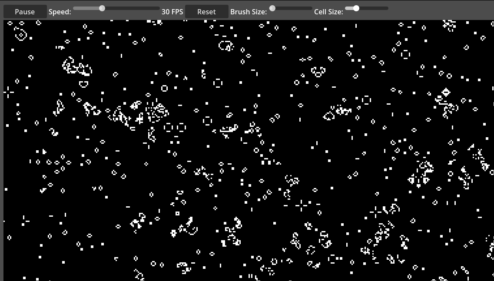

# Godot 4 Game of Life in Compute Shaders

Interactive Conway's Game of Life implementation using Godot 4.3 and GLSL compute shaders.

## Setup

1. Open in [Godot 4.3](https://github.com/godotengine/godot/releases/download/4.3-stable/Godot_v4.3-stable_win64.exe.zip)
2. Press play.

## Controls

- Left click: Draw cells
- Right click: Erase cells
- Speed slider: Adjust simulation speed
- Cell size: Change cell display size
- Brush size: Adjust drawing area
- Reset: Reset to empty board
- Pause/Play: Control simulation

## Requirements

- Godot 4.3+
- GPU with compute shader support
